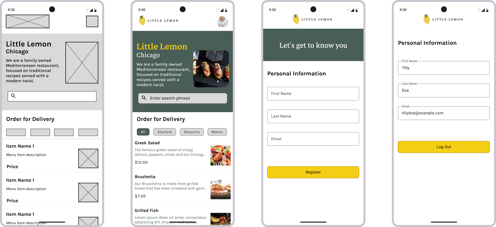
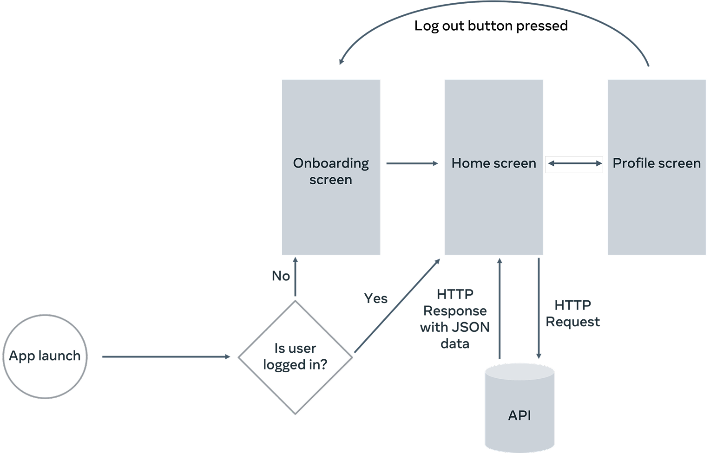
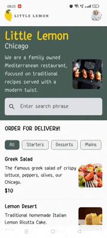

# Little Lemon Android Capstone App

## 🧾 Overview

An Android app developed as part of the Meta Android Developer Capstone project on Coursera. The app simulates a food ordering experience for the fictional Little Lemon restaurant, including onboarding, user profile, and a dynamic menu interface.

## ✨ Features

- Onboarding screen with user registration
- Profile screen displaying user information
- Home screen with:
  - Search bar to filter menu items
  - Category chips (Starters, Mains, Desserts) for filtering
  - Scrollable list of menu items with image, description, and price
- Local data caching using Room database
- Remote data fetching using Ktor and JSON
- Modern, responsive UI built using Jetpack Compose

## 🎨 Designs & User Flow

### ✏️ Wireframe & App Screens 


#### You can view the full design file, including wireframes, UI designs, and the design system, on Figma:  
[🔗 View Figma File](https://www.figma.com/design/1HINYBDvNLLa5zEXDR1a0k/Little-Lemon-Capstone-Project?node-id=1-3176&t=fdtUepRcH59rjY7T-1)

### 🧠 User Flow  


### 📱 App Demo
<p align="center">
  
</p>

## 🧰 Tech Stack

| Tool / Library       | Functionality                                  |
|----------------------|------------------------------------------------|
| Kotlin               | Programming language                           |
| Jetpack Compose      | Declarative UI toolkit                         |
| Ktor                 | Networking and API requests                    |
| Room                 | Local data storage using SQLite                |
| kotlinx.serialization| JSON parsing and serialization                 |
| Coil                 | Image loading                                  |
| Gradle               | Build system and dependency management         |
| Figma                | UI/UX design, wireframes, and prototyping      |
| Git & GitHub         | Version control and code collaboration         |

## 🚀 Setup & Installation

To run this project locally:

1. **Clone the repository:**
   ```bash
   git clone (https://github.com/Akira2206/little-lemon-capstone-project.git)
2. **Open the project in Android Studio.**

3. **Run the app** on an emulator or a physical device using Android Studio.

   ⚠️ **Make sure you have the latest version of Android Studio and Gradle installed.**

## 📚 References

- [Meta Android Developer Professional Certificate](https://www.coursera.org/professional-certificates/meta-android-developer?action=enroll)

